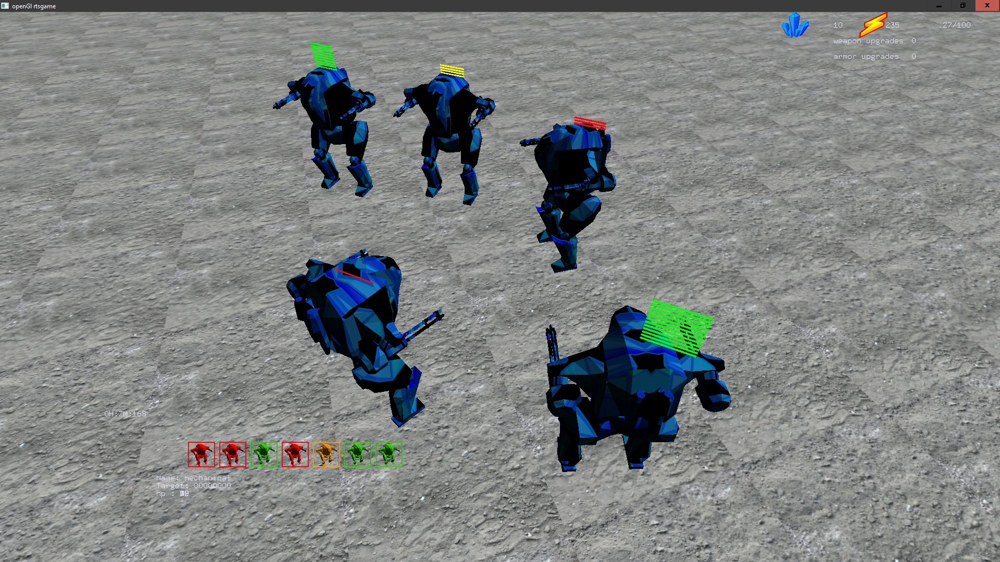
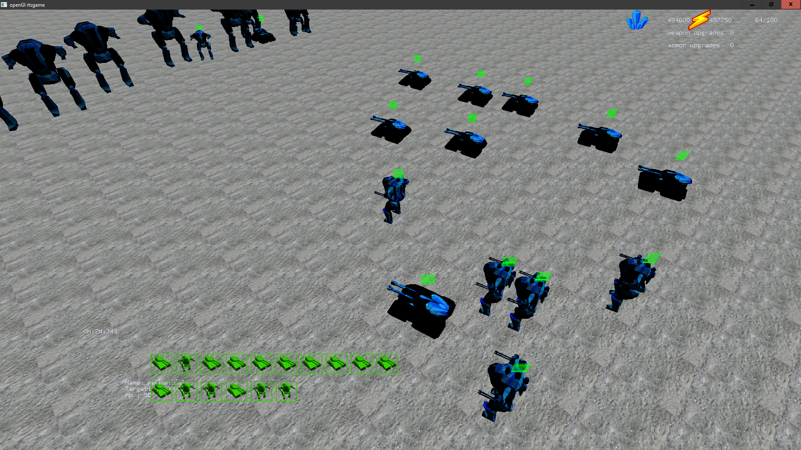

# RTS

My first attempt at making a videogame.

  

  

# Overview

This is a classic RTS game - you have to  gather resources build an amry and then destroy your enemies.

There are 2 primary resources - minerals and energy. Minerals can be mined and energy is produced in generators.
 
# Controls

- camera & movement
    Use mouse to hover camera

    O, P - turn camera

    Left click and "box" screen to select units

    Right click to move

- control groups

    ctrl + Q to P - create control group

    1-0 - call control group

- buildings

    W + left click - build generator

    E + left click - build factory

- train keys - build cost in parenthesis

    Q - train mech tier1 (25,10)

    W - train tank tier1 (30,15)

    shift + Q - train mech tier2 (75,45)

    shift + W - train tank tier2 (100,50)

    U - train recon plane (50,15)

    T - train worker (50,5)

    G - upgrade weapons (1000,800)

    H - upgrade weapons (1000,800)

- other
    
    X - start game

    S - stop command

    F - toggle friendly fire
# TODOS
I feel like Im done with the game, I might make some animations in the future so it feels more "alive". Maybe I will make some missing models for all  units that are already implemented.

I really enjoyed this project but I dont feel like writing another videogame anytime soon, however I'd like to implement multiplayer support and Im currently working on it.